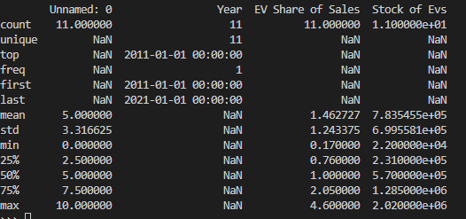
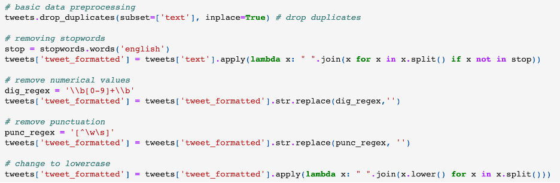
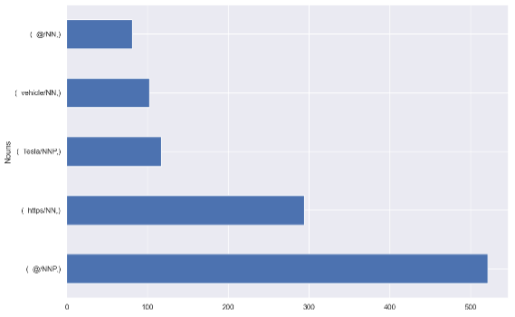
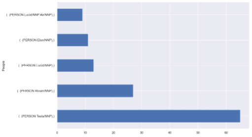
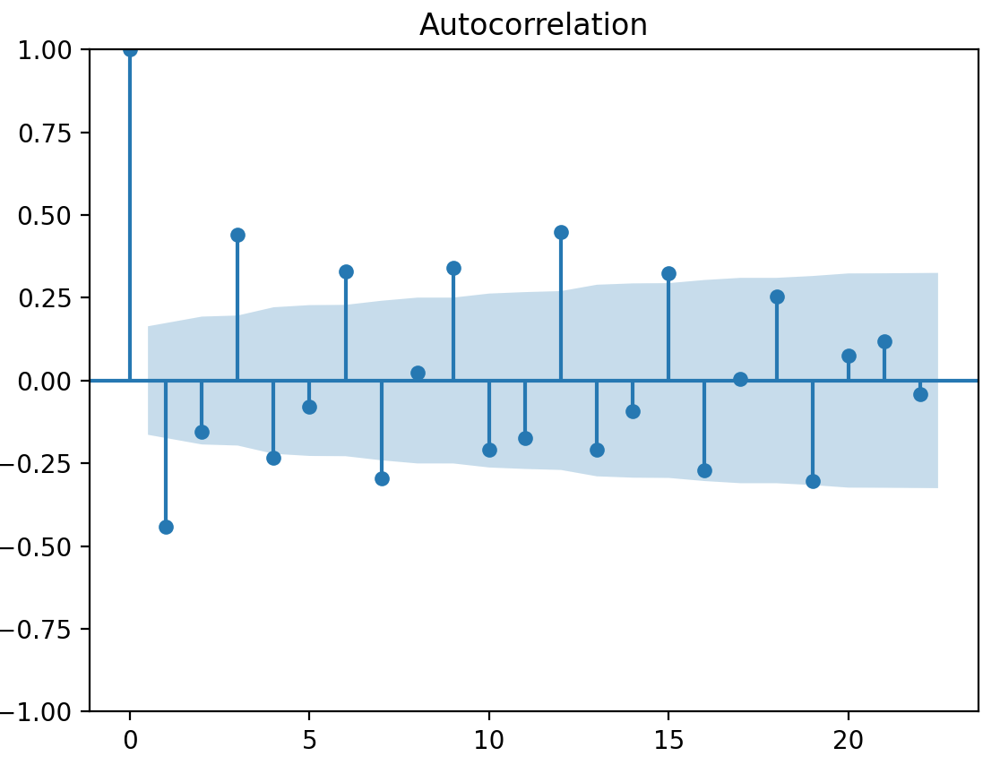

# The Electric Vehicle Transition

## An Analysis of Sentiment and Prevalence of Electric Vehicle Adoption 

Heidi Ramzel

Wes Sims 

Will Fiser 

Nikola Novakovic 

# Executive Summary
The market for electric vehicles (EVs) has seen rapid expansion over the last decade with no sign of slowing down. The past and future growth can be attributed to a variety of factors, particularly the positive environmental impact, long-term cost savings, and recently improved battery life. Moreover, factors such as new governmental incentives and increased consumer interest show that demand will only continue to grow. Our research indicates that in 2011, EV's averaged roughly 0.10% of the overall vehicle market share. Fast forward to the end of 2022 and the market share jumped to 6.26%, a 62x increase. Additionally, according to Bloomberg, global spending on electric vehicles is surging, with annual spending hitting $388 billion in 2022, up 53% from the year prior. Although there are a number of factors that may affect the degree to which the market expands, it is impossible to deny that the sector is seeing growth at a rate that has never been seen before. In our analysis, we reviewed data on EV market share, costs related to EV's, emission impacts of electrification, and consumer sentiment regarding the transformation taking place in the vehicular space.  

Based on our findings, we believe that automakers, legislative bodies, and consumers should prepare for a continued boom for electric vehicles. Through predictive analytics on market share, we have determined that the market share should be roughly 10.5% by 2028, an increase of 67% from the penetration rate at the end of 2022. As shown in the prior paragraph, EV's have seen exponential growth since the early 2010s. Based on our predictions, we do not expect this trend to slow down any time soon. Additionally, we have determined through our cost predictions that the cost of EVs should begin to decline in the near future as product efficiencies and innovative technologies will allow for a more affordable product. On top of that, increased market share and new emissions standards, combined with increases in incentives for purchasing electric vehicles, are projected to reduce transportation-related CO2 emissions in 2032 by about 10 percent. Lastly, text analytics have shown that the sentiment regarding EVs today is largely positive. The main reason for negative sentiment regarding the electrification of the automotive industry is typically associated with cost, which, as we have noted, should be addressed soon. In summary, the predictions for market share, cost, and emissions, along with the findings from our text analytics, indicate that the electric vehicle sector is here, and here to stay. With a boom expected, we recommend that automakers prepare fleets that are well-equipped to handle the growth, and legislative entities have the energy infrastucture in place to handle the increased load.  

Participating in this team are Wesley Sims, Heidi Ramzel, Will Fiser, and Nikola Novakovic.

# Table of Contents

<!-- vscode-markdown-toc -->
* 1. [Statement of Scope](#statement-of-scope)
  * 1.1 [Project Objectives](#project-objectives)
  * 1.2 [Unit of Analysis](#unit-of-analysis)
* 2. [Project Schedule](#project-schedule)
* 3. [Data Preparation](#data-preparation)
  * 3.1 [Data Access](#data-access)
    * 3.1.1 [Twitter API Access](#twitter-api-access)
    * 3.1.2 [BLS Static Table Scraping](#bls-static-table-scraping)
  * 3.2 [Data Cleaning and Transformations](#data-cleaning)
  * 3.3 [Data Reduction](#data-reduction)
  * 3.4 [Data Consolidation](#data-consolidation)
  * 3.5 [Data Dictionary](#data-dictionary)
    * 3.5.1 [EERE EV Market Share](#ev-market-share)
    * 3.5.2 [BLS Sales](#ev-market-share-total-sales)
    * 3.5.3 [EV Pricing](#ev-average-price)
    * 3.5.4 [DOE Registration](#ev-license-numb)
    * 3.5.1 [Twitter Data](#twitter-data-1)
* 4. [Data Dictionary](#data-dictionary)
* 5. [Descritive Statistics](#descriptive-statistics)
  * 5.1 [Kelly Blue Book Descriptive Stats](#kbb-descriptive)
  * 5.2 [EERE Blue Book Descriptive Stats](#eere-descriptive)
  * 5.3 [BLS Blue Book Descriptive Stats](#bls-descriptive)
  * 5.4 [DOE Blue Book Descriptive Stats](#doe-descriptive)
  * 5.5 [Descriptive Stats Summary](#descriptive-summary)
* 6. [Text Analytics and Predictive Analytics](#text-and-predictive-analytics)
  * 6.1 [Text Analytics](#text-analytics)
    * 6.1.1 [Sentiment Analysis](#sentiment-analysis)
    * 6.1.2 [Topic Modeling](#topic-modeling)
    * 6.1.3 [Named-Entity Recognition](#named-entity-recognition)
    * 6.1.3 [text analytics summary](#text-an-sum)
  * 6.2 [Predictive Analytics](#predictive-analytics)
    * 6.2.1 [EV Market Shared Forecast](#market-share-forecast)
    * 6.2.2 [EV Cost Forecast](#cost-forecast)
    * 6.2.3 [EV emissions forecast](#emissions-forecast)
* 7. [Conclusions and Discussion](#conclusions-and-discussion)
  * 7.1 [Links to Data Files:](#links-to-data-files)
  * 7.2 [Links to Code Files:](#links-to-code-files)
  * 7.3 [Link to Model](#links-to-model-files)
* 8. [Sources](#sources)
<!-- vscode-markdown-toc-config
	numbering=true
	autoSave=true
	/vscode-markdown-toc-config -->
<!-- /vscode-markdown-toc -->

# 

 
# Statement Of Scope
Our purpose for this project is to develop an understanding of consumer sentiment regarding electric vehicles and to compare this against recent trends taking place within the automobile industry. Additionally, we want to run predictive algorithms to provide an idea of the future of EV's, particularly around adoption rates, associated costs, and emissions. There are an array of benefits associated with these analyses, most notably the information it can provide on future consumer interest, automaker committments, and governmental policies. There will be two key portions in this study. The first focus of the project will revolve around public opinion on the shift to EVs by scraping the social media application Twitter based on specified keywords. The second focus of this study will involve in-depth analysis of various datapoints around the electrification of automobiles. Through descriptive analytics on scraped data, predicitve analytics based on historical data, and text analytics, our team will compile a variety of valuable insights around the constantly evolving transportation sector. We believe our findings and recommendations from this study will provide data driven support to key players in the EV market.

##  Project Objectives
This project will identify consumer sentiment on the shift towards electric vehicles. The project will also review the recent growth in the EV market and use this information to forecast future growth in the industry. The automotive market today is much different than it was just a decade ago, creating complexities for automakers and policymakers that never existed before. Fears around climate change are not new, dating back to roughly the early 1970s. At the time, those initial fears were typically reserved to scientists that were educated on the matter; however, when the 2000s came around, growing concern really took off amongst the general public. With the shift in public opinion regarding global warming and pollution associated with fossil fuels, the automotive industry was an easy target given that a typical passenger vehicle emits about 4.6 metric tons of carbon dioxide per year. In response, automakers have spent billions on innovative clean energy options while policymakers have implemented a multitude of emissions reduction goals. Through this study we are hoping to provide strategic recommendations to the key movers in the automotive industry pushing for electrification by providing valuable statistics around EV adoption, costs, and emissions. The objectives of the project include the following:

* Data Identification
    * Identify data from sources such as the `Office of Energy Efficiency & Renewable Energy`, the `Bureau of Labor Statistics`, `Kelley Blue Book`, and the `US Department of Energy` that provides insights on EV market share and adoption, costs, and emissions. 
    * Generate a list of keywords related to electric vehicles that can be searched for and scraped from Twitter.  
  
* Data Extraction
    * Web scrape the sources listed in the "Data Identification" stage to gather reliable data relative to the electric vehicle market.
    * Use Twitter’s API Platform to scrape Tweets that match the keyword criteria generated during the "Data Identification" stage. 
 
* Data Analytics
    * Gain insights on the market share, costs, and emissions associated with electric vehicles. 
    * Perform predictive analytics to forecast the future that electric vehicles have in the automotive sector. 
    * Perform text analytics on the data gathered from Twitter to determine the general feelings consumers have on electric vehicles. 
    * Visualize the descriptive, predictive, and sentiment analyses to assist in data driven strategic recommendations.

##  Unit of Analysis

Target Variables:

Twitter dataset contains these variables:

* created_at - represents a timestamp with date and time
* text - represents text of the tweet
* keyword - represents phrase/keyword used to query the twitter API

The `Office of Energy Efficiency & Renewable Energy` contains these variables:

* Date - represents a timestamp by month and year
* EV Percent of Market Share - the percent of the market made up by EV's during that month and year

The `Bureau of Labor Statistics` contains these variables:

* Year - represents a timestamp by year
* EV Share of Sales - the percent of all vehicles sales that EV's made up for that year 
* Stock of EVs - total number of EV sales

`Kelley Blue Book` contains these variables:

* Date - represents a timestamp by month and year
* New Car Average - the average price of all new cars 
* Average EV Price - the average price of new EV cars
* New Car Price Change - represents the month-over-month change in the price of all new cars 
* EV Price Change - represents the month-over-month change in the price of new EV cars

The `US Department of Energy` contains these variables:

* State - state of vehicle registration
* Electric (EV) - Electric vehicle registrations
* Plug-In Hybrid Electric (PHEV) - PHE vehicle registrations
* Hybrid Electric (HEV) - HE vehicle registrations
* Biodiesel - biodiesel vehicle registrations
* Ethanol/Flex (E85) - ethanol vehicle registrations
* Compressed Natural Gas (CNG) - CNG vehicle registrations
* Propane - propane vehicle registrations
* Hydrogen - hydrogen vehicle registrations
* Methanol - methanol vehicle registrations
* Gasoline - gas vehicle registrations
* Diesel - diesel vehicle registrations

# Project Schedule
Below is the GANTT Chart schedule for the project creation period, Deliverable 1, and Deliverable 2. In the GANTT chart, each deliverable is represented by a different color which includes: Project creation in blue, Deliverable 1 in orange, Deliverable 2 in green, and Project Presentation in yellow. On the left side is the specific task for each milestone, along with the corresponding start date. Lastly, the black "X" within each milestone represents the deliverables due date.

# Data Preparation
For the sentiment analysis, we collected over a 1000 tweets but there was a certain amount of bad data that we had to throw out. We ended up with 858 tweets. While it would be great to have gathered more tweets, we couldn't due to the way Twitter API rate limits it's data pulls. Our sample of tweets should be significant enough to gauage general population's opinions on electric vehicles.

The second part of our data preparation is to scrape a variety of EV data from a multitude of sources. Specifically, the `Office of Energy Efficiency & Renewable Energy (EERE)`, the `Bureau of Labor Statistics (BLS)`, `Kelley Blue Book (KBB)`, and the `US Department of Energy (DOE)`. The data from the EERE and BLS provides information on the growth of EV car sales and their consistent increase in the overall market share since 2011. Kelley Blue Book provides cost data by month since 2020 and compares the change in EV car costs to that of all cars in the market. Additionally, the DOE provides vehicle registration counts by state. Combined, these data sources will assist in providing a comprehensive view on the shift in the EV market, making way for descriptive and predictive analytics. 

##  Data Access
As mentioned in the prior paragraphs, our data is compiled from four main sources: Twitter (www.twitter.com), the `Office of Energy Efficiency & Renewable Energy` (www.energy.gov), the `Bureau of Labor Statistics` (www.bls.gov), `Kelley Blue Book` (www.kbb.com), and the `US Department of Energy` (www.energy.gov). Our team felt Twitter was the best option for unbiased public opinions relative to electric vehicles. To scrape Tweets from the social media application, our team made use of [Twitter's API platform](https://developer.twitter.com/en).

The other four data sources were selected as we felt they were reliable sources that provided accurate information on the subject matter. Following extensive review of a number of different sources, we narrowed down our search to these four final sources due to their reliability and trust as brands. They provided metrics in time-series formats that could be leveraged for predictive analytics, and also contained static tables that could be used for valuable descriptive visualizations. 

###  Twitter API Access

[Twitter's API platform](https://developer.twitter.com/en) requires signing up for developer access and receiving approval from Twitter. Twitter offers several different access levels, including Essential, Elevated, and Academic Research. Without knowing which access level we would need, each of our team members obtained developer accounts at either the Essential or Elevated levels. We found that one team member using Essential access was sufficient to gather enough tweets for the purposes of our evaluation.

[Twitter's API platform](https://developer.twitter.com/en) limits each search to the previous seven days' tweets. To keep the tweets relevant, we used the search terms shown in the table below in April 2023.

<table>
  <tr>
   <td colspan="3" ><strong>Search Terms</strong>
   </td>
  </tr>
  <tr>
   <td> love AND tesla
   </td>
   <td> rivian
   </td>
   <td> lucid AND air AND car
   </td>
  </tr>
  <tr>
   <td> electric AND vehicle
   </td>
   <td> hate AND electric AND car
   </td>
   <td> 
   </td>
  </tr>
</table>

Each time data is to be pulled from Twitter's API we have to provide API keys, keywords, and the number of times we want it pulled. Due to Twitter setting a limit on the number of tweets that can be pulled over a certain period of time, we will have to track which ones have already been searched for. Please refer to the screenshot below for the Python function used to pull tweets.

In the end, the data collection through Twitter’s API resulted in just shy of 900 tweets. A sample of the raw data extracted is shown below.

###  Static Table Scraping
On top of the scrape of Twitter, we also scraped data from various different websites. The other sources include the `Office of Energy Efficiency & Renewable Energy`, the `Bureau of Labor Statistics`, `Kelley Blue Book`, and the `US Department of Energy`. 

In January 2023, the [Office of Energy Efficiency & Renewable Energy](https://www.energy.gov/eere/vehicles/articles/fotw-1275-january-30-2023-monthly-plug-electric-vehicle-sales-united-states) released data on EV market share statistics through the end of 2022. As our team was looking for data that could be used for predicitve analytics, we landed on a goldmine as the EERE data came in a time-series format with data by month and year dating back to 2011. Highlighted in the linked article, the EERE determined that monthly sales of new plug-in electric vehicles (PEV) reached 7.4% of all light-duty sales in September 2022, including all-electric vehicles (EVs - 6.2%) and plug-in hybrid electric vehicles (PHEV - 1.2%), exceeding a 7% share for the first time. Although our project is specifically focused on just the electric vehicle side of the market, the statistic is still extremely noteworthy. Furthermore, in December of 2022, EV market share reached an all-time high, closing the year at 6.26%. The figure below shows a chart produced by the EERE with the data that we scraped. 

Just a month after the aforementioned release, in February of 2023, the [Bureau of Labor Statistics](https://www.bls.gov/opub/btn/volume-12/charging-into-the-future-the-transition-to-electric-vehicles.htm#_edn2) released an interesting article about the transition to electric vehicles. Although the premise of the article was to discuss occupations within the industry, it included numerous statistics on the transition. As our project revolves around the predicted growth in the sector, our team was specifically searching for metrics in a time-series format that could be used to forecast the change in the coming years. The BLS data includes the stock of electric vehicles and EV share of sales by year since 2011. Preliminary findings show that demand for EV's has skyrocketed in recent years, jumping from about 22,000 to more than 2 million between 2011 and 2021. The data by year will be used to forecast the future of EVs in the automotive sector. The figure below is the BLS chart that the data was scraped from. 

A few months prior to the BLS article, [CarEdge](https://caredge.com/guides/average-price-of-an-electric-car), a platform created to buy, own, and sell cars, released a study on the average price of an electric car with data gathered from `Kelley Blue Book`. Similar to the data gathered from the BLS, our team was in search of cost data in a time-series format to predict the future cost of EVs compared to all cars. The data from `Kelley Blue Book` includes the average cost of EVs and the average overall car cost by month and year since January of 2020. In the last year, major EV players such as Tesla have began price cuts for their automobiles to make them more affordable. These price cuts are tightening the cost gap between EVs and other cars, removing a key argument that naysayers have against the transition to electric vehicles. The car costs by month and year will be used to predict the change in the cost of cars. See the image below for the chart with the `Kelley Blue Book` data that was scraped. 

Lastly, the [Department of Energy's](https://afdc.energy.gov/vehicle-registration?year=2021) alternative fuel data center provides vehicles registration counts by state with a breakout by fuel type. The table from the DOE includes registration counts by 11 different fuel types, most notably electric, plug-in hybrid electric, and hybrid electric. Since we already have two other data sources in a time series format, we plan to use this data for descriptive analytics and visualiztions. That said, as the data continues to be explored in Deliverable 2, we may pull prior years to show the change over time. The figure below is an example of 5 states in the table and the data that was scraped. 

##  Data Cleaning and Transformations

Fortunately for us, data gathered through Twitter's API does not contain any missing values as we are scraping for certain keywords only. This means that there should be no issues with missing data being present in the dataset. 

While there were not any missing values, there was a significant amount of erroneous data. The Twitter API is designed such that the searches are not for specific phrases. Instead, the Twitter API searches for tweets containing any combination of the words in the search terms used. This is typical for most classic non streaming API. Because of this, there tends to be a lot of noise in the dataset. To mitigate, we used regex to transform the data. A more detailed explanation of the transformation process is provided below.

The data from Twitter consists of unstructured strings of various lengths. We did not not modify the data types as part of the data preparation process, but during analysis the strings were converted into numeric data measuring sentiment using a Hugging Face roBERTa-base model, amongst other things. The image below show some transformations that were done to the unstructured text data. 

The dataset gathered from the `Office of Energy Efficiency & Renewable Energy` contained EV market share by month and year since 2011 and had no outliers or erroneous data. The only clean-up necessary was converting the time-series data into a datetime data type. With the datapoints for each month and year being in decimal form, there was no need to change the float datatype to something different. The image below shows the quick change in Python.

For the dataset from the `Bureau of Labor Statistics` that contains total market share by year and total sales (`data/EIA_EV_Data.txt`), we don't have any outliers or erroneus data. We determined that from the graph provided and by simply exploring the data as a spreadsheet, since the data is sufficiently small. We had to convert total market share from string to a numeric column. The percentage signs were removed from the 'EV Share of Sales' column values as well.
We did that with `pandas`.

For the dataset from `Kelley Blue Book` that contains average price of EVs and other cars (`data/EV pricing.txt`) we don't have any outliers or erroneus data. Similarly to the previously mentioned data, the dataset was sufficently small and was examined as a spreadsheet. The percentage signs were removed from the 'New Car Price Change' and 'EV Price Change' columns as well as the dollar signs removed from prices. Then, we had to convert `New Car Average`,`Average EV Price`, 'New Car Price Change', and 'EV Price Change' from string to numerical values. We did that with `pandas`. 

For the final dataset from the `Department of Energy` that contains number of vehicles registered per state (`data/ev.csv`), we don't have any outliers or erronius data. Like its predecessors, the data was fairly small so we examined it in a spreadsheet for outliers/erronious data. The only data cleaning was removing the newlines between each data point, stripping the text, and converting to numerical values, which was done through the use of regular expressions (regex) and 'pandas' methods. Additionally, for statistics, we had to remove the United States total line.

##  Data Reduction
For the text data gathered from Twitter, we did not remove any variables, however we did have to remove a few rows. In Twitter’s API, relevant keywords or phrases do not produce results which only match what was requested. Instead, the results include any combination of the words from the search terms, and not necessarily in the same order and position as the search term. In order to reduce noise, we had to inspect the data and remove some of the noise.

Very little data reduction was necessary for the four datasets scraped from websites. A row with missing data was removed in the (`data/EV pricing.txt`) for descriptive statistics. The screenshot belows shows the reduction of the dataset through the removal of blanks.

The datasets that contain the change in market share by month and year from the EERE (`EV_Market_Share.txt`), total market share and and total sales by year from the BLS (`data/EIA_EV_Data.txt`), and the average price of EVs and other cars (`data/EV pricing.txt`) were all fairly small (in terms of rows and columns). With the rows just being representative of different moments in time, and there only being a few columns, the data was not in need of reduction. Similarly, for the dataset that contains number of vehicles registered per state (`data/ev.csv`), we did not have to perform any reduction.

##  Data Consolidation
After transformations of the raw Twitter data, it was determined that no further consolidation was required. The data came somewhat consolidated to start, and by excluding retweets, there was no need to separate the information into different files. Thus, the original format caused for no additional consolidation. 

The datasets that contain the change in market share by month and year from the EERE (`EV_Market_Share.txt`), total market share and and total sales by year from the BLS (`data/EIA_EV_Data.txt`), average price of EVs and other cars (`data/EV pricing.txt`), and number of vehicles registered per state (`data/ev.csv`) all came in consolidated formats with data series included. No further consolidation was required on our end. The data was exported as a csv.

Due to there being a pretty stark difference in the type of information in each dataset, we did not create a fully consolidated file that includes all information from all sources. That said, if we did decide to merge the data into a flat file, the process would be something like this. Starting with the source files (Twitter, EERE, BLS, KBB, and DOE), we would load each into separate data frames in R or Python. Step 1 is to trim the data to the essentials. So our resulting data frame would have a date and then all data that corresponds to that date across the different datasets. It is more than likely that the data would include a significant number of null values since they do not extend over this same time frame. Because of the null values, and variance in datasets, it did not seem to make much sense to do an entire consolidation. 

##  Data Dictionary

###  EERE - EV Market Share by Month & Year

<table>
  <tr>
   <td><strong>Attribute Name</strong>
   </td>
   <td><strong>Description</strong>
   </td>
   <td><strong>Data Type</strong>
   </td>
   <td><strong>Source</strong>
   </td>
   <td><strong>Example</strong>
   </td>
  </tr>
  <tr>
   <td>Date
   </td>
   <td>The date in question
   </td>
   <td> Datetime
   </td>
   <td> https://www.energy.gov/eere/vehicles/articles/fotw-1275-january-30-2023-monthly-plug-electric-vehicle-sales-united-states
   </td>
   <td>2011-01-01
   </td>

  <tr>
   <td>EV Percent of Market Share 
   </td>
   <td> Percent of market share made up of EV's during that month and year
   </td>
   <td> Integer representing percent
   </td>
   <td> https://www.energy.gov/eere/vehicles/articles/fotw-1275-january-30-2023-monthly-plug-electric-vehicle-sales-united-states
   </td>
   <td> 0.01
   </td>
  </tr>

  <table>
  <tr>
   <td><strong>Attribute Name</strong>
   </td>
   <td><strong>Purposes</strong>
   </td>
  </tr>
  <tr>
   <td>Date
   </td>
   <td> Will be used to analyze the change in market share over time.
   </td>
  </tr>
  <tr>
   <td>EV Percent of Market Share
   </td>
   <td> Will be used to predict the future change in EV market share.
   </td>
  </tr>
</table>

###   BLS - EV Market Share & Total Sales by Year

<table>
  <tr>
   <td><strong>Attribute Name</strong>
   </td>
   <td><strong>Description</strong>
   </td>
   <td><strong>Data Type</strong>
   </td>
   <td><strong>Source</strong>
   </td>
   <td><strong>Example</strong>
   </td>
  </tr>
  <tr>
   <td>Year
   </td>
   <td>The year in question
   </td>
   <td> Year
   </td>
   <td> https://www.bls.gov/opub/btn/volume-12/charging-into-the-future-the-transition-to-electric-vehicles.htm#_edn2
   </td>
   <td>2011
   </td>

  <tr>
   <td>EV Share of Sales
   </td>
   <td> Total share of sales of EVs for that year
   </td>
   <td> Percent
   </td>
   <td> https://www.bls.gov/opub/btn/volume-12/charging-into-the-future-the-transition-to-electric-vehicles.htm#_edn2
   </td>
   <td> 0.17%
   </td>
  </tr>

  <tr>
   <td> Stock of EVs
   </td>
   <td> Total market share of EVs for that year
   </td>
   <td> Integer
   </td>
   <td> https://www.bls.gov/opub/btn/volume-12/charging-into-the-future-the-transition-to-electric-vehicles.htm#_edn2
   </td>
   <td> 22000
   </td>
  </tr>
</table>

<table>
  <tr>
   <td><strong>Attribute Name</strong>
   </td>
   <td><strong>Purposes</strong>
   </td>
  </tr>
  <tr>
   <td>Year
   </td>
   <td> Will be used to analyze market share / sales of EVs over time.
   </td>
  </tr>
  <tr>
   <td>EV Share of Sales
   </td>
   <td> Will potentially be used to predict sales of EVs.
   </td>
  </tr>
  <tr>
   <td> Stock of EVs
   </td>
   <td> Will potentially be used to predict sales of EVs market share.
   </td>
  </tr>
</table>

###   CarEdge / KBB - Average Price Of EVs vs Price Of Normal Cars

<table>
  <tr>
   <td><strong>Attribute Name</strong>
   </td>
   <td><strong>Description</strong>
   </td>
   <td><strong>Data Type</strong>
   </td>
   <td><strong>Source</strong>
   </td>
   <td><strong>Example</strong>
   </td>
  </tr>
  <tr>
   <td>Date
   </td>
   <td> Date / month in question
   </td>
   <td>  Datetime 
   </td>
   <td> https://caredge.com/guides/average-price-of-an-electric-car
   </td>
   <td>1/1/20
   </td>

  <tr>
   <td> New Car Average
   </td>
   <td> Average price of new cars
   </td>
   <td> Integer
   </td>
   <td> https://caredge.com/guides/average-price-of-an-electric-car
   </td>
   <td> 38747
   </td>
  </tr>

  <tr>
   <td> Average EV Price
   </td>
   <td> Average price of EVs 
   </td>
   <td> Integer
   </td>
   <td> https://caredge.com/guides/average-price-of-an-electric-car
   </td>
   <td> 54669
   </td>
  </tr>

  <tr>
   <td> New Car Price Change
   </td>
   <td> MoM price change in the average price of new cars 
   </td>
   <td> Percentage
   </td>
   <td> https://caredge.com/guides/average-price-of-an-electric-car
   </td>
   <td> 3.03%
   </td>
  </tr>

  <tr>
   <td> EV Price Change
   </td>
   <td> MoM price change in the average price of EVs
   </td>
   <td> Percentage
   </td>
   <td> https://caredge.com/guides/average-price-of-an-electric-car
   </td>
   <td> -0.51%
   </td>
  </tr>
</table>

<table>
  <tr>
   <td><strong>Attribute Name</strong>
   </td>
   <td><strong>Purposes</strong>
   </td>
  </tr>
  <tr>
   <td>Date
   </td>
   <td> Will be used to analyze prices over time.
   </td>
  </tr>
  <tr>
   <td> New Car Average
   </td>
   <td> Will be used as a potential input to the model.
   </td>
  </tr>
  <tr>
   <td> Average EV Price
   </td>
   <td> Will be used as a potential input to the model.
   </td>
  </tr>
  <tr>
   <td> New Car Price Change
   </td>
   <td> Will be used as a potential input to the model.
   </td>
  </tr>
  <tr>
   <td> EV Price Change
   </td>
   <td> Will be used as a potential input to the model.
   </td>
  </tr>
</table>

###   DOE - Vehicle Registrations by State

<table>
  <tr>
   <td><strong>Attribute Name</strong>
   </td>
   <td><strong>Description</strong>
   </td>
   <td><strong>Data Type</strong>
   </td>
   <td><strong>Source</strong>
   </td>
   <td><strong>Example</strong>
   </td>
  </tr>
  <tr>
   <td> State
   </td>
   <td> U.S. State
   </td>
   <td>  String
   </td>
   <td> https://afdc.energy.gov/vehicle-registration?year=2021
   </td>
   <td> Alabama
   </td>
  </tr>

  <tr>
   <td> Electric (EV)
   </td>
   <td> Number of vehicles registered as EVs
   </td>
   <td>  Integer
   </td>
   <td> https://afdc.energy.gov/vehicle-registration?year=2021
   </td>
   <td> 4700
   </td>
  </tr>

  <tr>
   <td> Plug-In Hybrid Electric (PHEV)
   </td>
   <td> Number of vehicles registered as plug in hybrids
   </td>
   <td>  Integer
   </td>
   <td> https://afdc.energy.gov/vehicle-registration?year=2021
   </td>
   <td> 3300
   </td>
  </tr>

  <tr>
   <td> Hybrid Electric (HEV)
   </td>
   <td> Number of vehicles registered as hybrid electric
   </td>
   <td>  Integer
   </td>
   <td> https://afdc.energy.gov/vehicle-registration?year=2021
   </td>
   <td> 42500
   </td>
  </tr>

  <tr>
   <td> Biodiesel
   </td>
   <td> Number of vehicles registered as biodiesel
   </td>
   <td>  Integer
   </td>
   <td> https://afdc.energy.gov/vehicle-registration?year=2021
   </td>
   <td> 40500
   </td>
  </tr>

  <tr>
   <td> Ethanol/Flex (E85)
   </td>
   <td> Number of vehicles registered as ethanol/flex
   </td>
   <td>  Integer
   </td>
   <td> https://afdc.energy.gov/vehicle-registration?year=2021
   </td>
   <td> 449500
   </td>
  </tr>

  <tr>
   <td> Compressed Natural Gas (CNG)
   </td>
   <td> Number of vehicles registered as compressed natural gas
   </td>
   <td>  Integer
   </td>
   <td> https://afdc.energy.gov/vehicle-registration?year=2021
   </td>
   <td> 500
   </td>
  </tr>

  <tr>
   <td> Propane
   </td>
   <td> Number of vehicles registered as propane
   </td>
   <td>  Integer
   </td>
   <td> https://afdc.energy.gov/vehicle-registration?year=2021
   </td>
   <td> 100
   </td>
  </tr>

  <tr>
   <td> Hydrogen
   </td>
   <td> Number of vehicles registered as hydrogen
   </td>
   <td>  Integer
   </td>
   <td> https://afdc.energy.gov/vehicle-registration?year=2021
   </td>
   <td> 0
   </td>
  </tr>

  <tr>
   <td> Methanol
   </td>
   <td> Number of vehicles registered as methanol
   </td>
   <td>  Integer
   </td>
   <td> https://afdc.energy.gov/vehicle-registration?year=2021
   </td>
   <td> 0
   </td>
  </tr>

  <tr>
   <td> Gasoline
   </td>
   <td> Number of vehicles registered as gasoline
   </td>
   <td>  Integer
   </td>
   <td> https://afdc.energy.gov/vehicle-registration?year=2021
   </td>
   <td> 4051000
   </td>
  </tr>

  <tr>
   <td> Diesel
   </td>
   <td> Number of vehicles registered as diesel
   </td>
   <td>  Integer
   </td>
   <td> https://afdc.energy.gov/vehicle-registration?year=2021
   </td>
   <td> 123500
   </td>
  </tr>
</table>

<table>
  <tr>
   <td><strong>Attribute Name</strong>
   </td>
   <td><strong>Purposes</strong>
   </td>
  </tr>
    <tr>
   <td> State
   </td>
   <td> Will be used to analyze distribution of different types of vehicles by state. 
   </td>
  </tr>

  <tr>
   <td> Electric (EV)
   </td>
   <td> Will be used to potentially predict number of EVs in the future.
   </td>
  </tr>

  <tr>
   <td> Plug-In Hybrid Electric (PHEV)
   </td>
   <td> Will be used to potentially predict number of PHEVs in the future.
   </td>
  </tr>

  <tr>
   <td> Hybrid Electric (HEV)
   </td>
   <td> Will be used to potentially predict number of HEVs in the future.
   </td>
  </tr>

  <tr>
   <td> Biodiesel
   </td>
   <td> Will be used to potentially predict number of biodiesels in the future.
   </td>
  </tr>

  <tr>
   <td> Ethanol/Flex (E85)
   </td>
   <td> Will be used to potentially predict number of ethanol/flex vehicles in the future.
   </td>
  </tr>

  <tr>
   <td> Compressed Natural Gas (CNG)
   </td>
   <td> Will be used to potentially predict number of CNGs in the future.
   </td>
  </tr>

  <tr>
   <td> Propane
   </td>
   <td> Will be used to potentially predict number of propane vehicles in the future.
   </td>
  </tr>

  <tr>
   <td> Hydrogen
   </td>
   <td>Will be used to potentially predict number of hydrogen vehicles in the future.
   </td>
  </tr>

  <tr>
   <td> Methanol
   </td>
   <td> Will be used to potentially predict number of methanol vehicles in the future.
   </td>
  </tr>

  <tr>
   <td> Gasoline
   </td>
   <td> Will be used to potentially predict number of gasoline vehicles in the future.
   </td>
  </tr>

  <tr>
   <td> Diesel
   </td>
   <td> Will be used to potentially predict number of diesel in the future.
   </td>
  </tr>
</table>

###  Twitter Data

<table>
  <tr>
   <td><strong>Attribute Name</strong>
   </td>
   <td><strong>Description</strong>
   </td>
   <td><strong>Data Type</strong>
   </td>
   <td><strong>Source</strong>
   </td>
   <td><strong>Example</strong>
   </td>
  </tr>
  <tr>
   <td>created_at
   </td>
   <td>Time the tweet was posted.
   </td>
   <td>Timestamp
   </td>
   <td>https://developer.twitter.com/
   </td>
   <td>2022-10-12 20:00:27+00:00
   </td>
  </tr>
  <tr>
   <td>text
   </td>
   <td>Text of the tweet
   </td>
   <td>Text
   </td>
   <td>https://developer.twitter.com
   </td>
   <td>EVs rock!
   </td>
  </tr>
  <tr>
   <td>keyword
   </td>
   <td>Keyword we queried the API for
   </td>
   <td>Text
   </td>
   <td>https://developer.twitter.com
   </td>
   <td>EV
   </td>
  </tr>
</table>

<table>
  <tr>
   <td><strong>Attribute Name</strong>
   </td>
   <td><strong>Purposes</strong>
   </td>
  </tr>
  <tr>
   <td>created_at
   </td>
   <td> Will be used to look at tweet patterns over time.
   </td>
  </tr>
  <tr>
   <td>text
   </td>
   <td> Will be used to analyze the sentiment of how people feel about EVs.
   </td>
  </tr>
  <tr>
   <td>keyword
   </td>
   <td> Will be used to understand the distribution of tweets by keyword.
   </td>
  </tr>
</table>

# Descriptive Statistics

### Kelly Blue Book Dataset - Car Costs
It is very clear that, over time, both the New Car Average and Average EV Price increase overall from the provided graph from Kelly Blue Book. However, we can see that changes over time are more steady in the new car price than the ev price. Additionally, EV pricing is has historically always been higher than the standard car price. Another thing to note is that this data is through just the end of 2022. In early 2023, Elon Musk and Tesla began a number of price cuts to their cars. Although it might have had an immaterial impact to the average price across the whole market, it could be indicative of future trends in the sector. 

Next, we looked at the correlation between the average car price and the average price of an EV. We can see that they are heavily correlated, and specifically at ~0.789. 

Lastly, we chose to do a quick review on the descriptive statistics for all variables. For our analysis we are primarily focused on the last 4 columns. Outside of the standard deviation, 75%, and max, the means, medians, and min, appears to have bad data, indicated by a number of `NaN` values. As we think about predictive modeling, these areas of bad data might need to be addressed. Looking past this, we can see that standard deviation is 3,393 for the new car average and 4,488 for the electric vehicle average. The higher standard deviation for electric vehicles shows there is a higher degree of variance for the prices of these vehicles. The max and 75% values for the price of electric vehicles is also considerably higher than those of a standard new car. This indicates that that pricing can be much more expensive for EVs when compared to a standard new car. 

### EERE Dataset - EV Market Share by Month and Year
The original dataset provided by the EERE includes plug-in electric vehicles (PEV) and plug-in hybrid electric vehicles (PHEV). For the sake of our analysis, we do not need either of these datapoints. Thus, we leveraged the scraped data and created our own line chart. The image below shows the EV market share by month and year from 2011 through the end of 2022. As alluded to throughout this report, market share has seen exceptional growth since the early 2010s, in large part due to new new legislative standards around emissions. As these standards become more common, the growth of EVs in the automotive industry will only increase. 

After reviewing the above data, the next step is to understand the table of means, medians, standard deviation, min, and max. The average market share of everything month from January 2011 to December 2022 is 1.26%. The minimum value, which was the market share on 01-01-2011 was 0.01%, and the maximum value was 6.26%, realized in December of 2022. These statistics show 2 things: 1.) there has been never before seen growth in the EV sector since 2011, and 2.) the average being roughly 1 and a quarter percent is large driven up from high market share rates in recent months/years. The standard deviation is about 1.5, with the median value being about 0.5. It is important to note that there is a considerable difference between the average value and the median value. This proves that the recent high market share rates are having a pretty extreme impact on the average.

### BLS Dataset - EV Market Share and Sales by Year
Let's first take look at the graph provided by BLS (this graph was also shown earlier), which shows the market share and sales of electric vehicles by year from 2011 to 2021. We can see that, clearly, both share of EV sales (percentage) and stock of electric vehicles have increased signficantly over the last decade. As mentioned in the opening paragraph, there has been more than a 60x increase in market share, with that increase being seen the most in recent years. 

Next, we took a look into the table of means, medians, standard deviation, min, and max to gather some high level statistics of the dataset. By looking at the means, it appears the average market share in the BLS data set was 1.5%, with the average number of sales being about 780,000. The minimum market share for a year was 0.17%, with the minimum number of sales being 22,000. Conversely, the maximum share was 4.6%, with the max sales being 2.02 million. There is a considerable difference between the minimum and maximum value, which highlights the exceptional growth seen within the sector. Lastly, the data does still come with some `NaN` values that might need additional review. 

### DOE Dataset - Vehicle Registrations by State and Fuel Type
The last dataset that we gathered descriptive statistics on is the information gathered from the DOE. Below is a sample of the dataset we are using. As a reminder, this table shows vehicle registration counts by state and fuel type. This dataset is also representative of just 2021. We went back and gathered other years of historical data, but for the purpose of these descriptive stats, we are just leveraging one year. 

Similar to the previously shown datasets, we needed to get a grasp on the descriptive information through the use of the table of means, medians, standard deviation, min, and max. The descriptive stats we performed were for all columns, however, for the sake of brevity we are focusing on just the EV column. The average number of electric vehicle registrations across all 50 states was roughly 56,000 cars in 2021, which, at first glance, did not seem too out of the ordinary. This, in large part, was driven up due to an incredibly high max value of more than 1.5 million. If you remember, earlier we stated that 2021 had a total of just over 2 million EV sales, so our team immediately felt something was up. This was the first red flag. The second red flag came when we noticed an abnormally large standard deviation. 

As a result, we chose to look at outliers through the use of box and whisker plots. Although some outliers can be seen in various of the columns, gasoline has a datapoint that stands out head and shoulder above the rest. 

After recognizing the massive outlier for gasoline, we decided it was worthwhile to dig into that row of data. By looking up the maximum value for gasoline data, we were able to find the entire row and determine that the United States had a summed row that was being included in our descriptive statistics. The row also shows that not only is gasoline inflated, but so are all of the other columns being summed across the country. 

Once we removed the U.S. row, we again took at look at the statistics for the states' spread of data. Even at first glance, it is very clear that the removal of the outlier allowed for significantly improved results. The average EV registrations for the 2021 calendar year across all 50 states now show a value of 28,500, half of the original figure shown with the outlier included. The standard deviation is aboout 80,000, which may appear to be large, however, is easily explained as states like North Dakota had just 400 registrations (minimum value), whereas California had more than 550,000 (maximum value). The descriptive statistics of statewide registrations provides very interesting insights on the descrepenceny of EV registrations in the U.S. As we know, some states are leaders in the charge, however, penetrating the markets of North Dakota or Wyoming, for example, may be a great way to keep accelerating EV market share. 

With the improved statistics, we also chose to rerun the boxplots to ensure that things look as though they normalized. Although the chart still shows some potential outliers, quick research indicates that these outliers are typically just the large states with high levels of registrations. In other words, since this is just a count of all registrations, we are not surprised as there has not been an adjustment for population. With significant population differences between the states, we do expect spread to be high.

To validate these assumptions, we went ahead and looked up the states with the highest gasoline car registrations and EV registrations. Both of these were located in California. With a quick Google search for the most populated states, it is easy to confirm that California indeed has the highest population of the states listed (and DC).

With that thought in mind, we couldn't help but wonder what the inverse results were. So, we looked up the states with the lowest EV and gas powered car registrations. Results show that that the lowest amount of Gasoline car registrations is in the District of Columbia, which makes sense because they have massive public transportation and a smaller population when compared to the majority of the other states. Likewise, North Dakota has the lowest EV registration count at just 400 in 2021. This is also unsurprising as anyone in the United States knows that the population of North Dakota is on the lower side of the spectrum when compared to other states.

### Descriptive Statistics Summary
In summary, these descriptive statistics provide an array of value, particularly aiding in a measurement on how good the data is. In some cases it was determined that outliers were still included. This also helped to cleanse the data of any abnormalities prior to running predictive analytics. Regardless of the sophistication of the predicitive algorithms that we choose to use, the results are only as good as the data used to train them. In other words, incorrect data yields inaccurate insights. The good news for us, however, is that bad data can be often stripped out, allowing our models to avoid using bad data and yield the most optimal results. With the data cleansed, transformed, reduced, and explored, it is now in a good spot to move into predictive analytics. The preceding sections will focus on predictions relative to EV adoption, EV costs, and EV emissions, along with text analytics from Tweets gathered from Twitter. 

# Text and Predictive Analytics
Now that the data sources have been described and reviewed, the methodology for our report has been discussed, the data has been cleansed, and preliminary statistics have been gathered, we can move forward with the long-awaited text and predictive analytics. In the sections that follow, we will perform text analytics on data scraped from Twitter, including a sentiment analysis, topic modeling, and named-entity recognition. Additionally, we will run predictive models to determine what the future market share for electric vehicles and costs of them looks like. 

##  Text Analytics
Text analytics leverage machine learning models to extract valuable insights from unstructured, text data. With text analytics, things such as consumer sentiment on certain subjects can be gathered (ex: is there a positive or negative outlook on hybrid work). Text analysis can also provide the topics associated with text data to determine what the topics generally are in regard to a specific subject. With text traditionally being an unstructured data source, it can be challenging to gather insights on things such as surveys, questionaires, or even just review platforms. Thankfully, with the use of these complex models, we can turn this data into a helpful tool assisting in data-driven decisions. 

### Sentiment Analysis
As mentioned in the earlier sections, nearly 900 tweets were scraped from Twitter through the use of the applications API. These tweets met the criteria outlined by certain keywords pertaining to the electric vehicle industry and will assist in gathering a sample of the public sentiment regarding the electric transition. 

Prior to running the analysis, it is essential to perform some data preprocessing. Out of all the data out there, text is the most unstructured, meaning there is a large amount of cleansing that is needed. These pre-processing steps help convert noise from high dimensional features to the low dimensional space to obtain as much accurate information as possible from the text. To preprocess our dataset, we dropped duplicates, removed stopwords, removed numerical values, removed punctuation, and changed all letters to lowercase. The images below display the code that was used to perform the cleansing, as well as a few records showing the original text and the formatted text. The preprocessing code was referenced earlier in this report, however, we included it again as we felt the value applied here as well. 

We also ran some descriptive analytics to gather an idea of the distribution of tweets for the keywords that were used. These high-level, preliminary statistics help show which keywords hold the most weight in the sentiment analysis. As you can see, "Love AND Tesla", "Rivian", and "Electric AND Vehicle" make up the majority of the tweets that were gathered. See the rest of the distribution by keywords used below.

With the data cleansed and some descriptive statistics explored, we can now move into the sentiment analysis. By using [Hugging Face's twitter-roBERTa-base-sentiment model](https://huggingface.co/cardiffnlp/twitter-roberta-base-dec2021-emotion?text=I+really+don%27t+like+electric+vehicles), we were able to group the tweets into four categories: "Joy", "Anger", “Optimism”, and "Sadness". Each of these categories was used to gauge public sentiment toward electric vehicle adoption and the public opinion regarding the EV sector. The results show that the majority of tweets fall within the “joy” category (ex: "@JPUConn I LOVE my chrome Tesla plate frame. It doesn't have to match the trim"), with “anger” being the second most common group (ex: "@bgrahamdisciple Because it's still a trash electric vehicle with limited functionality"). Although the example for the “joy” category might not be the most direct, it is clear that the car is bringing about a positive emotion. The example of a tweet in the “anger” category is obvious, as the emotion is noticeably negative. Those two categories made up roughly 75% of all tweets. “Optimism” was the third most common and “sadness” was the least common. See the image below for the distribution of tweets by their corresponding sentiment category.

We also chose to look at the data in a more simplified way by combining the “joy” and “optimism” categories into one group and “anger” and “sadness” into another. The combination of the categories into 2 groups will make the topic modeling and named-entity recognition analyses signifcantly easier to run. These results were slightly easier to interpret, as it became very clear how many tweets were associated with a positive standpoint versus a negative one. 

We can see that a lot of people from our sample feel positive emotions (joy & optimism) about electric vehicles. Conversely, roughly 35% of our sample group feel anger and sadness when it comes to EVs. With the new, exciting, and innovative offerings that electric vehicles are brining into the automotive industry, this makes perfect sense, hence why roughly 67% of tweets display a positive emotion when discussing the product. On the flip side, it also makes sense why that number isn’t higher, considering many people still have looming fears about the transition (cost, new technology, nostalgia factor, etc.). Lastly, the model performs well (84.5% F1 score on the mentioned dataset), but all models could typically use some sort of enhancements. If we wanted to improve its performance, we would need to obtain a larger sample of electric vehicle specific tweets and fine tune the language model. 

### Topic Modeling
Following the sentiment analysis, we performed some topic modeling. For reference, sentiment analyses are typically limited to identifying sentiment polarity, whereas topic modeling can identify complex themes and subtopics within the data. Before extracting the main topics for the two simplified categories (“Joy and Optimism” and “Anger and Sadness”), we stemmed the words as this makes topic modeling much easier. The code used to stem the words is shown below.

After the words were stemmed, we decided to extract the three main topics from tweets falling in the combined “Joy and Optimism” group and the “Anger and Sadness” group. In the group of tweets displaying positive emotions towards EVs (joy and optimism) people were talking about their love for Tesla (first topic), lucid air and electric cars (second topic) and EV charging, batteries, and Rivian (third topic). See below for the code used to generate the topics of the positive tweets, along with the 10 words falling in each topic.

Next, the same thing was done for our negative emotion group. This group includes the tweets falling in the “Anger” and “Sadness” categories. Results show that the tweets falling in this sentiment area often discussed their dislike of Tesla’s (first topic), Tesla’s competitors (second topic), and politics and electric vehicles (third topic). The code and top 10 words for each topic of the negative group are displayed below.

It is easy to distinguish the differences between the topics of the positive group when compared to those of the negative group. Often times we see the topics being exact opposites of each other, as should be expected considering the emotions associated with each are entirely different. These topics help to validate the feelings that the public feels in relation to the electrification transition within the sector. 

### Named-Entity Recognition
The last portion of our text analytics was to perform named-entity recognition (NER). Named-entity recognition is a form of natural language processing (NLP) that involves extracting and identifying essential information from text. NER seeks to locate and classify named entities mentioned in unstructured text into pre-defined categories such as person names, organizations, locations, and more. With our dataset, we chose to look at the top 5 nouns, people, organizations, and locations for both groups of tweets (“Joy and Optimisim” and “Anger and Sadness”). The 4 images below, displaying nouns, people, organizations, and locations, all apply to the positive emotion group.

While our NER appears to need a considerate amount of refinement (a lot of items that were in our top 5 charts are not captured correctly by the NER algorithm), the results shown above for tweets that were positive make sense.

For our locations, China is shown in the top 5 which makes sense due to Tesla’s, and EV’s in general, large presence that region. For the top 5 organizations, SpaceX and Tesla pop out, as one would expect considering that Elon is the CEO of both of those companies and Tesla is a dominant player in the EV space. Speaking of Elon, he stands out in top 5, which again should be expected for the aforementioned reasons. And lastly, for top 5 nouns, vehicle & Tesla stand out, which also makes sense as these tweets are about electric vehicles.

As mentioned earlier, the same NER analysis was performed for our tweets falling in the negative sentiment group. Similar to the format above, the preceding 4 images relate to the nouns, people, organizations, and locations associated with the tweets in the “Anger and Sadness” group. 

While, again, our NER process is in need of some refinement, the results we see above from negative tweets fall in line with what we would expect. Being that the tweets relate to similar keywords, there is quite a bit of overlap between the positive tweets NER and the negative tweets NER. Vehicle and Car stand out in the top 5 nouns, Elon in people, Lucid in organizations, and China and America in locations. These are in agreement with electric vehicle discussions in general for the similar reasons we mentioned in the NER analysis above (for positive tweets). In the topic analysis that we did people were talking about their love (or hate) for the Tesla, their competitors, China and Elon and those topics align with the NER analysis that we did.

### Text Analytics Summary
In summary, the texts analytics that we performed provided valuable insights regarding opinions on electric vehicles, the topics of tweets associated with these sentiments, and the entities often associated with these thoughts. The sample that we gathered appeared to be largely in favor of electric vehicles, with ~65% of the tweets displaying positive emotions when discussing the topic. Often times with innovative solutions, penetrating the perceptions of the existing population is the hardest part. As EV’s continue to penetrate the automotive industry, it can be expected for these positive feelings to only continue to grow. On the flip side, the negative sentiment of some tweets provides some crucial tidbits that automobile companies should look to address as they plan to grow their EV market. Engine issues, cost, and more all seem to be top of mind for people who are against the introduction of electric vehicles into a historically gas ran industry. As electric vehicle manufacturers address these looming fears, adoption rates should only expect to grow. There will always be naysayers, however, many are on the fence due to issues that have the ability to be fixed. Our recommendation would be to capitalize on the things that EV manufacturers are doing right, as highlighted by the positive tweets, and spend time digging into the negative tweets to determine what is worth addressing now. 

Lastly, the sentiment analysis, topic modeling, and named entity recognition code can all be found together in  the `sentiment_analysis.ipynb`.

##  Predictive Analytics
On top of text analytics, our team also performed a number of predictive analytics as well. Part of the challenge in the data gathering phase was locating data that was provided in a time series format that could be used for forecasting. Once those sources were identified, our team could then move forward with predictive analytics. Although the information provided thus far could already provide a number of recommendations to players within the EV industry, we wanted to be sure to forecast the future of the market to help show how things may shake out 5 to 15 years from now. Thus, predictions on the growth in the EV market share, along with expected change in the cost, were performed to assist in strategic recommendations. 2 different models were made for both market share and cost (4 models in total).

### Electric Vehicle Market Share Forecast
We started the first market share forecast by running rolling statistics to see the variation in the mean and the standard deviaton. As seen in the image below, the mean is trending upward at a fairly signifcant clip. This is driven up in large part to the significant increase shown in recent months.

The next step was to look at seasonality trends and residuals through the use of the ETS decomposition tool. The two images below include the code used to run the decomposition, along with the results. As seen in the results, the data comes with quite a bit of seasonality and also follows an upward trend. Additionally, the average value, or the mean of the residuals, seem to be zero which holds our assumption.

Now we will check whether the data is stationary or not. For this, we will perform a test called the Dickey-Fuller test. In the field of statistics, the Dickey-Fuller test (ADF) is used to test the null hypothesis, i.e. to check if a unit root is present in a sample of a time-series data. The alternative hypothesis is considered to be different on the version we use but is usually considered stationarity or trend-stationarity. In other words, we are trying to decide whether to accept the Null Hypothesis or go with the Alternative Hypothesis (that the time series has no unit root and is stationary).

We end up deciding this based on the return of the p-value. A small p-value which is considered below 0.05 indicates strong evidence against the null hypothesis, thereby we reject the null hypothesis. A large p-value which is considered above 0.05 indicates weak or no evidence against the null hypothesis, thereby we fail to reject the null hypothesis.

After running the above function, we get the following output:

Now it is clear that the data is non-stationary so we need to apply differencing to make our data stationary. We have also realised that our data is seasonal. This means we need to use Seasonal ARIMA on our model. If our data was not seasonal, it means we could have used just ARIMA on it. We will take this into account while differencing our data.

The first step is to perform the differencing. Once differencing is ran and the data is stationary, we will run an autocorrelation. The image below displays the result of the autocorrelation ran on the differenced data.

The next step is to actually run the SARIMA model. The first image below is the code used to run the model, with the image that follows displaying the results of the model. After that is an image displaying the accuracy of the model by comparing the predicted values to that of the actuals. As you can see, the results are not great. Because of this, we chose to test a second model in hopes of better results. 

The second model took a different approach. The first step of the second model was to run an autocorrelation plot.The autocorrealtion model determined that anything higher than 0.24 would be considered highly correlated. Thus, based on the image below, it was determined that first 22 lags fall within that range. 

Next we fit the model to those 22 lags. Note that this order of events is signifcantly different than what was seen in the first model. Model fitting was one of the final steps in model 1, whereas it is one of the first steps in model 2. After fitting the model, we ran a line plot of the residuals and a density ploy of the residuals. These two plots are shown below, respectively, along with the descriptive statistics as well.

Following this step, the data was split into training and validation datasets, with a 70/30 split. Following the split, we ran a walk-forward validation, which is a code that returns predicted values next to expected values, allowing us to see in tabular form how close the predictions compare. The image below shows expectations vs actuals from May of 2019 to December 2022 so we can see how the model performs. Lastly, for reference, the test RMSE was 0.526. This is a very satisfactory model based on RMSE. 

As shown in the image above, the performance of model 2 was significantly better than that of model 1. Thus, we leveraged model 2 for our predictions. By taking the second model and extrapolating out expectations for the next 5 years, we have determined that market share will grow to roughly 10.5% by 2028, a 67% increase from the market share at the end of 2022. Throughout this report, we have alluded to high growth expectations in the near future. Our predictive modeling validates this belief, with the results showing that EV growth should only continue to climb as we approach 2030. See the image below for a look at the future of the EV market. 

### Electric Vehicle Cost Predictions
Similar to the market share forecast, 2 different models were ran for our cost predictions. The beauty of our market share data is that in came by month and year dating back to 2011. This means we had 144 historical datapoints to build a model off of. Unfortunately, the public data that we could locate for electric vehicle costs was much smaller. Although the data is in month and year, it only goes back to January 2020, meaning there is only 36 points to run a model off of. Although we knew that the lack of historical data will make modeling slightly more difficult, we chose to move forward anyways. Also, different than the market share forecast, rather than running a second model with training and validation datasets, we chose to use the standard SARIMA model for both, but with parameter adjustments to see which performed best. Lastly, our pricing predictions span out 15 years to the late 2030's, much longer than the market share models which were just 5 years.

Since we leveraged the same model, outside of a parameter change, the first couple steps are the same for each. Tp start, we ran a line chart to get a high level look of the trends of EV pricing. Although the chart clearly indicates somewhat of a bumpy ride, it shows the prices have increased overall over the last 3 years. 

Next, similar to the first model of the market share forecast, we plotted some rolling average statistics to get a look at the variation of the mean and standard deviation. The results clearly show a somewhat linear increase in the rolling average price of EVs. In addition, the standard deviation shows some movement, reflecting the roller coaster ride of pricing.

The next step was the decomposition to get a closer look at trends, particularly seasonality and residuals. Trends show the steady increase in cost, seasonality shows that it does indeed exist, and the residuals show some steady movement +/- 2,000. 

The results from the decomposition, along with the results for the below ADF test show that the data is non-stationary. This means that we must difference our data prior to running our model. 

Following the differencing and confirming that the data is no longer non-stationary, we ran a stationarity plot to visualize the results, along with an autocorrelation plot. From reviewing these outputs, we have determined that we can move forward with our predictive. Up to this point, all components have been the same for both models. The parameters of the model itself is what causes them to differ. The first model that we ran was comprised of an ARIMA model with P, D, and Q values of 0, 1, and 0, respectively. The second model was comprised of a slightly different ARIMA model, with its P, D, and Q values being 1, 2, and 1, respectively. The two images below display the results of the two different models. The first image is the first model and the second image is the second model.

After running the models to see how they performed through comparing actuals with model predictions, we then ran predictions for both to see how those compared as well. The two images below display the forecasts of the two different models. The first image is the first model and the second image is the second model.

Based on the images above, it is very clear that model 1 was the model with the best performance. Model 2 must've had a back-end issue that is causing an error when modeling as the forecasted values head towards 0. Model 1, however, seems to be somewhat indicative of previous trends. This model predicts future values for the next 15 years, which is slightly more long-term than our market share model (5 years). Modeling out this long-term is somewhat of a tough task with the limited amount of data that we started with, however, we want to provide some statistics that are much more forward thinking. In summary, it appears that the cost of electric vehicles is supposed to fluxuate between an increase of about $5,000 and $10,000 over the next 15 years. 

Although these predictions are believably, we do feel it is necessary to play Devil's Advocate with our results. This data ended in 2022, meaning that it does not include the price cuts that EV manufacturers such as Tesla have implemented in 2023. These price cuts would potentially be reflected in the chart had their been data for it. Furthermore, it is no secret that the EV industry will continue to discover ways on increasing efficiencies and implementing new and innovative technologies. Increased efficiency along with technological advancements will also help provide a decrease in the cost of production and the subsequent cost to purchase electric vehicles. That saud, we are not inferring that our predictions are incorrect, rather we believe there may be external factors that are not displayed in this current forecast. To refine this forecast more, we'd recommend adding in those details and the potential impact it may have on future price changes. 

### Electric Vehicle Emissions Reduction Forecast
A large component in the argument for electric vehicle adoption is the positive environmental impact from a decrease in emissions. The largest source of CO2 emissions in the United States, and a majority of other large countries, comes from the transportation sector; and 16% of all global emissions comes from road transport. Traditionally, the automotive industry has been dominated by gas powered vehicles, and, until recently, there was not much of a solution to reduce the emissions associated with them. With the introduction of electric vehicles in the 2000s, CO2 emissions are already starting to see a significant reduction. 

According to the `Congressional Budget Office`, emissions from the transportation sector in 2021 were 6% less than they were in 2005. Despite an increase in travel over the same period of time, increased vehicular efficiencies and the introduction of a booming electric industry has resulted in recognizable progress. That said, the reduction of said emissions is no easy task, in large part due to the reliance that the transportation sector has on petroleum. 

Unfortunately, there is a lack of public data relative to emissions savings from the growth in market share of electric vehicles, therefore we were incapable of performing our own in-house predictions on emissions savings. Since we could not perform our own predictive analytics, we chose to draw on public releases on the matter as we still felt there was value in highlighting the expected impact that EVs will have on emissions. In other words, we do not take credit for these predictions, rather are just showcasing the results.

As mentioned throughout this report, governmental regulations will play a large role in the electrification of the transportation industry. These incentives and standards have already played a significant impact, however, changes take a while to occur. The existing vehicle stock is replaced very slowly as the average age of passenger vehicles driven in the U.S. is 12 years. This means that the value of the regulations put into effect today might not be seen for another decade. With this in mind, emissions reductions will most likely have a very gradual decline, rather than a stark decrease when new standards are implemented. Based on this idea, it is expected that legislative changes adopted in the early 2020s will result in transportation-related CO2 emissions in 2032 that are 0.16 BMT (or about 10 percent) lower than the agency estimates they would have been without those changes. The image below highlights these expectations.

# Conclusion And Discussion
In summary, we gathered data from the `Bureau of Labor Statistics`, `Kelley Blue Book`, the `Department of Energy`, and Twitter. Our states data would also be served better with population data, so we will search to include that in that dataset for Deliverable 2. The data scraped from our three static sources went fairly smooth for our team, with no issues arising throughout the process. Our data includes two different sources with time-series formats, one for EV adoption by year since 2011 and the other for pricing by month and year since January 2020, which will be used for predictive analytics. Also included is a table on vehicles registrations by fuel type which will be used for descriptive analytics and other visualizations. In addition, we leveraged Twitter's API to scrape a number of tweets relative to the electric vehicle market. We will use the data scraped from Twitter to gather an idea of consumer sentiment and opinion on EVs. Lastly, the scraped data was fairly clean, allowing for a pretty easy data clean up process. 

In conclusion, we believe that automakers, legislative bodies, and consumers should be prepared for a continued boom for electric vehicles. As shown above, our predictive analytics indicate that by 2028 market share should increase roughly 67% when compared to 2022, and occupy more than 10% of the overall light-duty market. Our report has shown time and time again that EV's have seen exponential growth since the early 2010s, and, according to our findings, on our predictions, this is not expected to change any time soon. Additionally, we have determined through our cost predictions that the cost of EVs will most likely decline in the near future as product efficiencies and innovative technologies will allow for a more affordable product. Although our forecast technically displays a somewhat different answer, we feel that if we could adequately add in technological advancements and effiency progress, that the story would be much different. Furthermore, increased market share and new legislative requirements, along with incentives offered for the purchase of electric vehicles, are projected to reduce transportation-related CO2 emissions in 2032 by about 10 percent. And finally, text analytics have shown that the sentiment regarding EVs today is largely positive, making up more than 65% of the sample group that we analyzed. On the rare occasion that there was a negative point-of-view, it was typically associated with cost, which we believe will be handled as time progesses. To summarize, our predictions for market share, cost, and emissions, along with the findings from our text analytics, indicate that the electric vehicle sector has a long life ahead of it. It is clear that EV's will not only play a pivotal part in the fight against climate change, but it will also play a huge role in getting the general public from point A to point B in the coming years. It is said that "with great power comes great responsibility", and this reamins true for key stakeholders in the EV industry today. Being that a boom is coming in the sector, we recommend that automakers prepare fleets that are well-equipped to handle the growth, and legislative entities have the energy infrastucture in place to handle the increased load.

###  Links to Data Files:
EV Market Share: https://github.com/msis5223-pds2-2023spring/project-deliverable-1-ev-power/blob/main/data%20(scraped%20files)/ev_market_share_transformed.csv

EV Sales Data: https://github.com/msis5223-pds2-2023spring/project-deliverable-1-ev-power/blob/main/data%20(scraped%20files)/ev_pricing_transformed2.csv

EV Pricing Data: https://github.com/msis5223-pds2-2023spring/project-deliverable-1-ev-power/blob/main/data%20(scraped%20files)/ev_sales_transformed2.csv

Vehicle Registration Data: https://github.com/msis5223-pds2-2023spring/project-deliverable-1-ev-power/blob/main/data%20(scraped%20files)/ev_t2.csv

###  Links to Code Files:
Scraped Data File: https://github.com/msis5223-pds2-2023spring/project-deliverable-1-ev-power/blob/main/code%20(scripts)/wes_scrape.py

Data Cleaning File 1: https://github.com/msis5223-pds2-2023spring/project-deliverable-1-ev-power/blob/main/code%20(scripts)/transform_data.py

Descriptive Statistics and Further Cleaning File: https://github.com/msis5223-pds2-2023spring/project-deliverable-1-ev-power/blob/main/code%20(scripts)/heidi_clean_stats.py

###  Links to Text and Predictive Analytics Models:
Text Analytics: https://github.com/msis5223-pds2-2023spring/project-deliverable-1-ev-power/blob/main/code%20(scripts)/sentiment_analysis.ipynb

EV Market Share Model 1: https://github.com/msis5223-pds2-2023spring/project-deliverable-1-ev-power/blob/main/code%20(scripts)/ev_market_share_ts.py

EV Market Share Model 2: https://github.com/msis5223-pds2-2023spring/project-deliverable-1-ev-power/blob/main/code%20(scripts)/ev_ms_ts2.py

EV Cost Model 1: https://github.com/msis5223-pds2-2023spring/project-deliverable-1-ev-power/blob/main/code%20(scripts)/pricing_ts.py

EV Cost Model 2: https://github.com/msis5223-pds2-2023spring/project-deliverable-1-ev-power/blob/main/code%20(scripts)/pricing_ts2..py

# Sources:
Bureau of Labor Statistics. 2023. _Charging into the future: the transition to electric vehicles._ Retrieved from: https://www.bls.gov/opub/btn/volume-12/charging-into-the-future-the-transition-to-electric-vehicles.htm#_edn2

CarEdge. 2022. _The Average Price of an Electric Car (Updated Monthly)._ Retrieved from: https://caredge.com/guides/average-price-of-an-electric-car

Department of Energy - Alternative Fuels Data Center. 2021. _Vehicle Registration Counts by State._ Retrieved from: https://afdc.energy.gov/vehicle-registration?year=2021

Congression Budget Office. 2022. _Emissions of Carbon Dioxide in the Transportation Sector._ Retrieved from: https://www.cbo.gov/publication/58861. 

